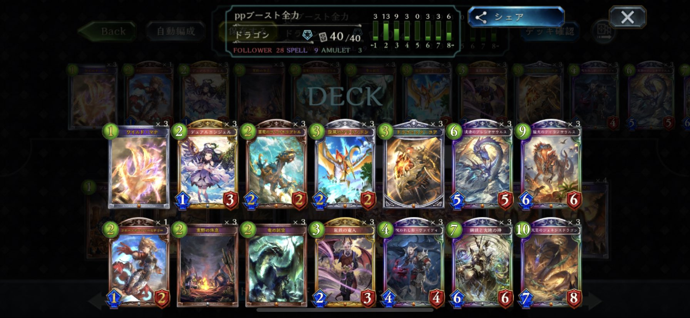

こんにちは。Andyです。
機械自然ドラゴンでランクマを回している時に、
- ノインがかなりキツく感じたこと
- ppブーストが足りないこと
- リソースがどんどん細くなっていくこと
- 細かい盤面処理が苦手なこと
に結構ストレスを感じていました。

自然ドラゴンを使っている上でこのような問題点が生じている人は是非この構築を使ってみてください。  

今回特徴的なカードは
- プレシオサウルス
- ジェネシスドラゴン

の二種類だと思います。

この二種類に関して簡潔に考察していきたいと思います。

## プレシオサウルスについて

プレリリースからディスカードドラゴンの主軸となり大暴れしたカードです。  
即日ナーフされ、ディスカードドラゴンと共に姿を消しましたが、その強さは健在でした。  

プレシオサウルスの特徴としては
- 自然
- 高スタッツ
- 10pp進化無償
- 進化時に
  - ハンド1捨て2ドロー
  - 盤面2点、相手リーダー1点
  - 条件で2回復

ということです。　　
ディスカード軸をメインとしなくてもかなりの効果が期待できます。  
後に紹介するジェネシスドラゴンで進化権を消費してしまうことがあるのですが、10ppにさえなってしまえば
無償で進化ができるようになるので非常に相性が良いです。ppブーストを進める価値がこのカードにはあります。  
同じ6コスト帯として「母なる君」が上げられますが、このカードは
- ナテラが進んでいないと(1or3枚割れていないといけない)弱い
- リソースを補充することができない

という欠点があります。ppブーストに力を注いで、盤面を取り返そうとしても、ナテラが割れてない
その後のリソースが続かず結局押し負けてしまう…  
といったことが多発します。もちろん、上振れ値は高いカードなので1枚くらいは採用しても良いと思います。  
それに比べてプレシオサウルスは10ppでなければ進化権を使うことにはなりますが、最低限の盤面処理をしながら、
ハンドを減らさずリソースを回復することができます。  
ナテラのプレイしている回数に左右されないので、プテラノドンがppブーストに絡まなかった場合でもリソースを減らすことなく、ppブーストした恩恵を受けることができます。  
回復はできなくなってしまいますが、終盤に不要な託宣や被ってしまったジェネシスドラゴンを捨てて2ドローできるので、鋼鉄の神の融合素材を新たに探すことにも繋がり、
デッキの潤滑油と機能してくれます。  
さらに、自身が自然カードであるため、鋼鉄の神の効果を受けて強固な盤面を築くことができるようになります。  

これらの理由から3投してもプレシオサウルスは事故の要因になりにくく、安心してデッキを回すことができます。  

## ジェネシスドラゴンについて
ジェネシスドラゴンの主な役割としては
- ppブースト
- 横展開の処理
- 疾走でフィニッシュ

この3点になります。  
2tに託宣、その次にジェネシスドラゴンの受けを作ることができます。（後手ヴァンプ以外はジェネシスドラゴンをマリガンでキープはしません。）  
これにより次のターンには6pp分動くことができます。  
嵐鉄の竜人は覚醒状になることによってプロダクトマシーンを3枚ハンドに加えることができますが、これは鋼鉄の神の融合素材を増やすことにつながるのでデッキのコンセプトとして
如何に早く覚醒状態に入るかが一つの鍵になっています。
ドラゴニックコアと違って即時にppブーストできるのは次のターンにすぐ恩恵を受けることができるので嬉しいです。  
また、ヴァンプの4ターン目のノインやAFネメシスといった横並びが強いクラスに対して、進化権を使うことにはなりますが、盤面を取りながらppブーストを進めることができるのは非常に強いです。  

またアクセラレートを使用しなくても最後の打点として活躍してくれることが多いです。  
鋼鉄の神やプレシオサウルスで作った盤面を相手は返すのでいっぱいになり、守護を張る余裕がなくなる（ノインが起動したら別ですが）ので、基本的には7点通せる印象です。  
また、複数被って処理に困ったとしてもプレシオサウルスの進化時の弾にできるのでかさばって負ける時は少ないので文句なしの3投です。
